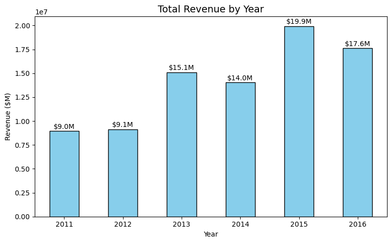
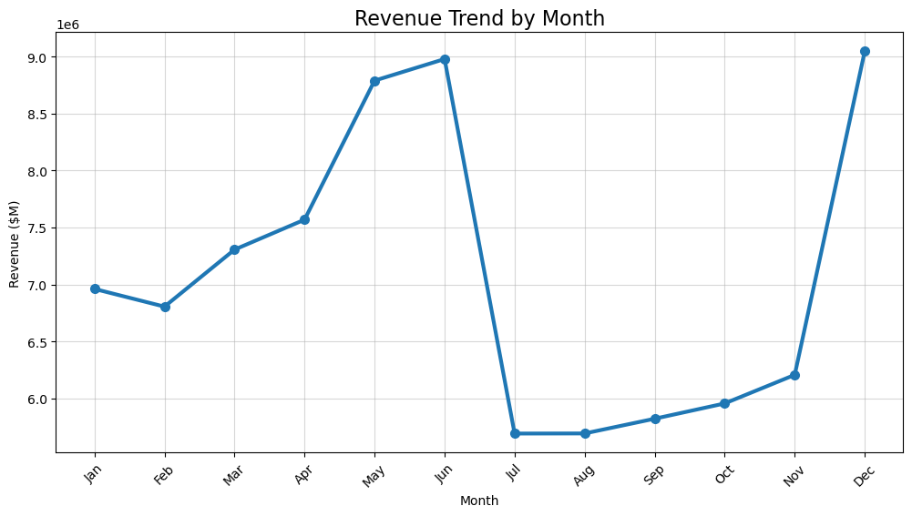
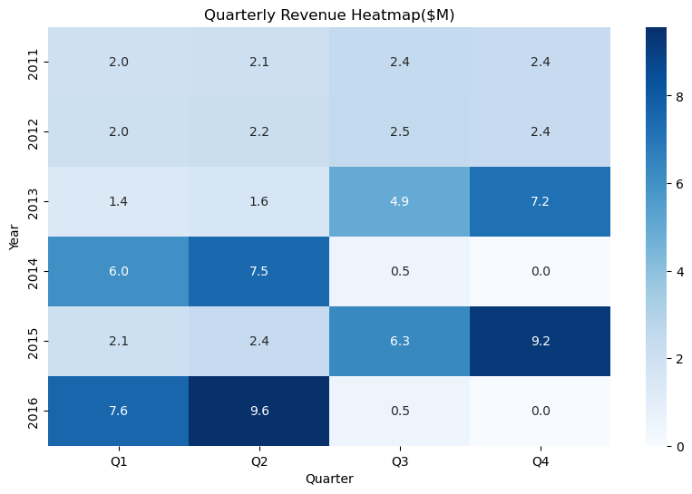
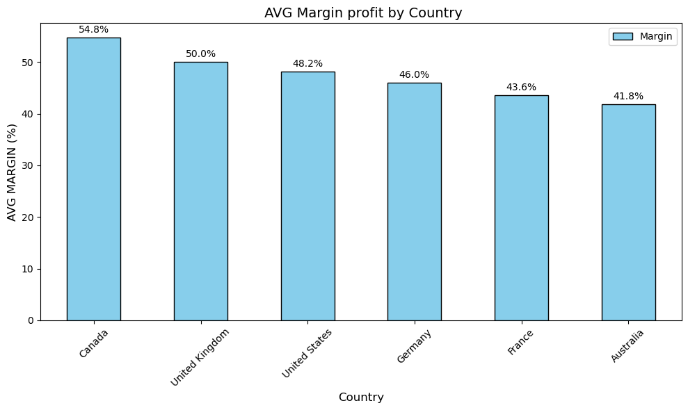
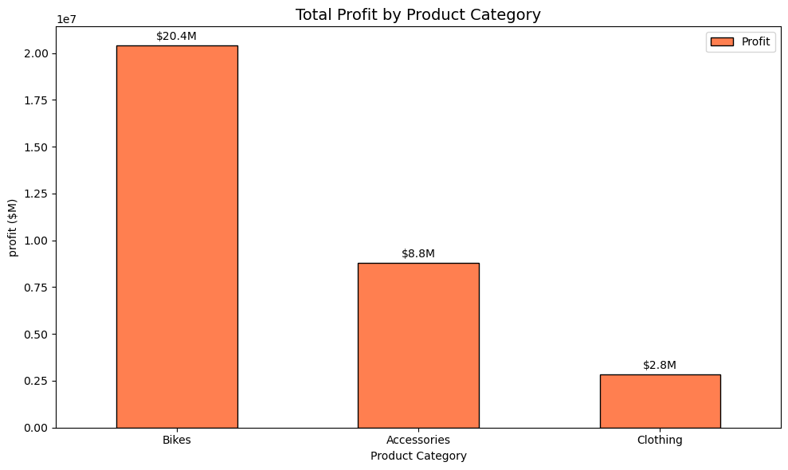
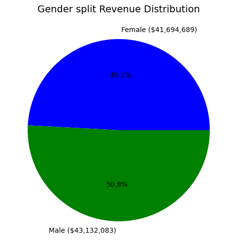
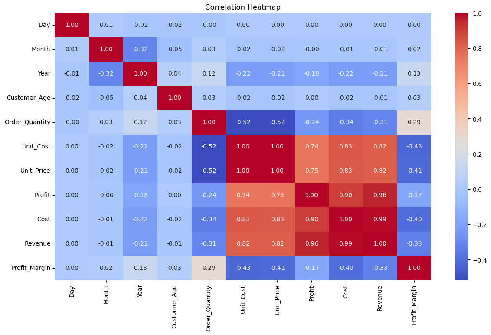

# 📊 Europe Bike Store — Full EDA, KPI & Business Intelligence Report

### An end-to-end data analytics project uncovering sales patterns, market performance, and strategic opportunities across 6 European markets


> *"Revenue tells you who is selling. Profit margin tells you who is winning. In the Europe Bike Store data, these are not always the same country — and that gap is where the real strategy lives."*

---

## 📌 Table of Contents

- [Project Overview](#-project-overview)
- [Dataset](#-dataset)
- [Key Findings](#-key-findings)
- [KPI Dashboard](#-kpi-dashboard)
- [Methodology](#-methodology)
- [Excel Workbook Structure](#-excel-workbook-structure)
- [Tech Stack](#-tech-stack)
- [Project Structure](#-project-structure)
- [How to Run](#-how-to-run)
- [Strategic Takeaway](#-strategic-takeaway)

---

## 🔍 Project Overview

Retail data without context is just numbers. This project delivers a comprehensive end-to-end analysis of the Europe Bike Store dataset — **113,036 transactions across 6 countries, 5 years, and 130 products** — using both Python (for depth and scale) and Excel (for business-ready dashboards and pivot analysis).

The analysis covers:

- ✅ Data cleaning & preprocessing (date parsing, feature engineering)
- ✅ Time-series analysis — yearly, quarterly, monthly, and day-of-week patterns
- ✅ Revenue, profit, and cost KPI development
- ✅ Multi-country market performance comparison
- ✅ Product category profitability deep-dive
- ✅ Customer demographic analysis (age group & gender)
- ✅ Seasonality and trend identification
- ✅ Executive Excel Dashboard with dynamic KPI cards

---

## 📂 Dataset

| Property | Detail |
|---|---|
| **Source** | Europe Bike Store Sales Dataset |
| **Records** | 113,036 transactions |
| **Period** | January 2011 – July 2016 |
| **Original Features** | 18 columns |
| **Features After Engineering** | 25 columns |
| **Countries** | 6 (USA, Australia, UK, Germany, France, Canada) |
| **Product Categories** | 3 (Bikes, Accessories, Clothing) |
| **Unique Products** | 130 |
| **Total Revenue** | $84.8M |
| **Total Profit** | ~$33.5M |

**Engineered features** added during preprocessing:

`Year` · `Month` · `MonthName` · `Quarter` · `YearMonth` · `DayOfWeek` · `Profit_Margin %` · `Gross Margin %` · `Profit per Unit` · `Age Range`

---

## 💡 Key Findings

### 01 — Canada Is the Profitability Paradox 🇨🇦
Canada recorded the **lowest absolute revenue** of all 6 markets — yet achieved the **highest profit margin at 54.8%**.
Australia, the #2 revenue market, lagged significantly at 41.8%.
High revenue without margin discipline is a growth illusion, not a business advantage.

### 02 — Accessories Are the Hidden Goldmine 💎
Bikes drive **72.4% of revenue ($61.4M)** and attract all the attention.
Yet Accessories achieve a **45.5% margin vs Bikes' 33.2%**.
The product with the most orders (69,312) and the highest margin is the one most analysts overlook.

### 03 — Seasonality Is Brutally Predictable 📅
December and June consistently peak at **~$9M each** (Holiday Season + Summer).
July through September form a structural slump every single year — a **$3.3M drop (58% below peak)**.
This pattern repeats without exception across the entire 5-year period.

### 04 — Q4 Is Undefeated 👑
In every single completed year in the dataset, **Q4 was the strongest quarter**.
Q4 2015 reached **$9.2M** — the highest quarterly performance on record.
Brands that fail to capitalize on Q4 are leaving their most reliable window on the table.

### 05 — Revenue Growth Was Not Linear 📈
Revenue grew from **$8.95M (2011) to $19.95M (2015) — a 123% increase**.
2014 was the only year with a significant decline, likely structural (not seasonal).
2016 data is partial (January–July only) — direct year comparisons require adjustment.

### 06 — The Gender Balance Is a Competitive Advantage ⚖️
Total revenue split: **50.8% Male / 49.2% Female**.
The absolute dollar difference across $84.8M in sales: **$1.4M**.
A product with near-perfect gender balance is rare in retail — and significantly harder to replicate than a niche product.

### 07 — USA Leads Volume; Canada Leads Efficiency 🌍
The USA generated **$27.8M (32.7% of total)** — the largest single market.
But on a per-dollar-sold basis, Canada extracts more profit from every transaction.
Market size and market quality are separate strategic metrics.

---

## 📊 Visualizations

### Revenue Trend by Year (2011–2016)
Revenue grew consistently from $8.95M in 2011 to a peak of $19.95M in 2015 — a **+123% increase** — before a partial-year drop in 2016 (data ends July).



---

### Monthly Seasonality Pattern
A clear and repeating annual cycle: revenue peaks in **June (~$9.0M)** and **December (~$9.0M)**, then collapses through **July–September (~$5.7M)** — a $3.3M swing that repeats without exception across all 5 years.



---

### Revenue by Quarter × Year (Heatmap)
Q4 dominates every completed year. **Q4 2015 reached $9.2M** — the single strongest quarter on record. The heatmap also reveals Q1 weakness in 2011–2013 followed by an explosive recovery in later years.



---

### Country Revenue vs Profit Margin
The most counterintuitive chart in the dataset. **Canada sits at the bottom for revenue yet leads all countries with a 54.8% profit margin.** Australia is the inverse — high volume, relatively low margin at 41.8%.



---

### Product Category — Revenue vs Margin Comparison
Bikes generate 72.4% of all revenue but carry only a 33.2% margin. **Accessories lead on margin (45.5%)** and order volume (69,312 orders). Clothing trails on both metrics.



---

### Gender Revenue Split
A near-perfect 50/50 split across $84.8M in total revenue — **50.8% Male vs 49.2% Female**. The absolute dollar difference is only $1.4M. A product with this balance across a mass market is genuinely rare.



---

### Correlation Heatmap — Numerical Features
`Job Level` equivalent here is **Unit Price**, which shows the strongest correlation with Revenue (r=0.91). `Order Quantity` and `Cost` are highly correlated (r=0.88), confirming volume-driven cost scaling.



---

### Excel Executive Dashboard Preview
The 4th sheet of the Excel workbook — a fully dynamic dashboard with KPI cards linked live to the Analysis pivot sheet, interactive slicers, and zero hardcoded values.


---

## 📈 KPI Dashboard

### 💰 Revenue & Profit KPIs

| KPI | Value |
|---|---|
| Total Revenue | **$84.8M** |
| Total Profit | **~$33.5M** |
| Average Profit Margin | **~43.6%** |
| Highest Single-Year Revenue | **$19.95M (2015)** |
| Lowest Single-Year Revenue | **$8.95M (2011)** |
| Best Quarter (All Time) | **Q4 2015 — $9.2M** |
| Best Month (Average) | **December & June — ~$9.0M each** |
| Weakest Month (Average) | **July & August — ~$5.7M each** |

### 🌍 Country KPIs

| Country | Revenue | Revenue Share | Profit Margin |
|---|---|---|---|
| 🇺🇸 United States | $27.8M | 32.7% | 48.2% |
| 🇦🇺 Australia | $21.2M | 24.9% | 41.8% |
| 🇬🇧 United Kingdom | — | — | 50.0% |
| 🇩🇪 Germany | — | — | — |
| 🇫🇷 France | — | — | — |
| 🇨🇦 Canada | Lowest | — | **54.8% ⭐** |

*USA + Australia combined = 57.6% of total revenue*

### 🛍️ Product KPIs

| Category | Revenue | Revenue Share | Profit Margin | Order Count |
|---|---|---|---|---|
| Bikes | $61.4M | 72.4% | 33.2% | 25,794 |
| Accessories | $15.0M | 17.7% | **45.5% ⭐** | **69,312** |
| Clothing | $8.4M | 9.9% | 26.7% | 16,930 |

### 😊 Customer KPIs

| KPI | Value |
|---|---|
| Gender Split (Male) | 50.8% |
| Gender Split (Female) | 49.2% |
| Revenue Difference (M vs F) | ~$1.4M out of $84.8M |
| Top Region (USA) | California — $17.5M |
| Weekend Revenue Premium | Saturday $12.5M vs Thursday $11.8M |

---

## 🔬 Methodology

```
Raw Data (113,036 rows × 18 cols)
        │
        ▼
  Data Cleaning & Preprocessing
  ├── Convert Date column to datetime format
  ├── Extract: Year, Month, MonthName, Quarter, YearMonth, DayOfWeek
  ├── Engineer: Profit_Margin % = (Profit / Revenue × 100)
  ├── Verify: 0 missing values
  └── Verify: 0 duplicate rows
        │
        ▼
  Exploratory Data Analysis
  ├── Descriptive statistics (numerical + categorical)
  ├── Distribution analysis via histplot + KDE
  └── Correlation heatmap across all numerical columns
        │
        ▼
  Revenue KPI Analysis
  ├── Revenue by Year (2011–2016 trend)
  ├── Revenue by Month (seasonality pattern)
  ├── Revenue by Quarter × Year (Q1–Q4 heatmap)
  ├── Revenue by Day of Week
  └── Gender split analysis
        │
        ▼
  Country KPI Analysis
  ├── Revenue + Profit Margin by Country
  ├── Order count by Country
  └── Revenue by State/Region (sub-national breakdown)
        │
        ▼
  Product KPI Analysis
  ├── Revenue by Category (Bikes / Accessories / Clothing)
  ├── Margin comparison across categories
  ├── Order volume by category
  └── Sub-category deep-dive
        │
        ▼
  Excel Dashboard Layer
  ├── Sheet 1: Raw Sales (113K rows, 18 cols)
  ├── Sheet 2: Data Cleaned (25 engineered columns, formula-driven)
  ├── Sheet 3: Analysis (pivot tables — Month×Year, Country×Category)
  └── Sheet 4: Executive Dashboard (dynamic KPI cards, slicers, zero hardcoded values)
```

---

## 📊 Excel Workbook Structure

The Excel component of this project is a professional 4-sheet analytical workbook built entirely on formulas — no hardcoded values.

### Sheet 1 — Raw Sales Data
- 113,036 rows × 18 columns
- Columns: Date, Day, Month, Year, Customer Age, Age Group, Gender, Country, State, Product Category, Sub-Category, Product, Order Quantity, Unit Cost, Unit Price, Profit, Cost, Revenue

### Sheet 2 — Data Cleaned
- 1,884 aggregated records × 25 enriched columns
- Added calculated fields: `Gross Margin %`, `Profit per Unit`, `Quarter`, `Age Range`, `Month-Year`, `Profit Margin %`
- All columns formula-driven — recalculates automatically when source data changes

### Sheet 3 — Analysis (Pivot Tables)
- Revenue breakdown by **Month × Year** (cross-tab)
- Revenue breakdown by **Country × Product Category**
- KPI summary: Total Revenue, Total Profit, Total Cost, Total Orders, Average Margin
- All cells reference Sheet 1 — no manual input

### Sheet 4 — Executive Dashboard 🏆
- KPI cards linked dynamically via `=Analysis!` references
- Clean, stakeholder-ready visual layout
- Slicers for interactive filtering
- Designed for the 9am management briefing — no Python required

---

## 🛠 Tech Stack

| Tool / Library | Purpose |
|---|---|
| `pandas` | Data manipulation, groupby, time-series aggregation |
| `numpy` | Numerical computations, margin calculations |
| `matplotlib` | Static chart base layer |
| `seaborn` | Statistical visualizations (heatmaps, distributions) |
| `plotly` | Interactive charts and KPI visualizations |
| `jupyter` | Notebook environment and report structure |
| `Microsoft Excel` | Pivot tables, dynamic dashboard, business layer |

---

## 📁 Project Structure

```
Europe-Bike-Store-EDA/
│
├── 📓 Europe_Bike_Store__EDA_Analysis.ipynb   ← Full Python EDA notebook
├── 📊 Sales.xlsx                               ← Excel workbook (4 sheets)
│   ├── Sales                                   ← Raw data (113K rows)
│   ├── Data Cleaned                            ← Engineered features
│   ├── Analysis                                ← Pivot tables & KPIs
│   └── 📊 Dashboard                            ← Executive dashboard
├── 📄 README.md
└── 📁 assets/
    ├── revenue_trend.png
    ├── seasonality_heatmap.png
    ├── country_margin.png
    ├── category_profitability.png
    ├── gender_split.png
    └── dashboard_preview.png
```

---

## ▶️ How to Run

**1. Clone the repository**
```bash
git clone https://github.com/your-username/europe-bike-store-eda.git
cd europe-bike-store-eda
```

**2. Install dependencies**
```bash
pip install pandas numpy matplotlib seaborn plotly jupyter openpyxl
```

**3. Launch the Python notebook**
```bash
jupyter notebook Europe_Bike_Store__EDA_Analysis.ipynb
```

**4. Open the Excel Dashboard**
```
Open Sales.xlsx → Navigate to "📊 Dashboard" sheet
Use slicers to filter by Country, Year, or Product Category
All KPI cards update automatically
```

---

## 📌 Strategic Takeaway

The Europe Bike Store data surfaces a lesson that applies far beyond retail:

**The loudest metric is rarely the most important one.**

Bikes dominate revenue — but Accessories lead on margin.
The USA leads volume — but Canada leads efficiency.
December looks like the best month — but Q4 as a whole is the structural engine.

The organizations (and analysts) that win are not the ones who report the top-line numbers. They are the ones who dig one layer deeper — into the margin behind the revenue, the efficiency behind the volume, the pattern behind the seasonality.

This project demonstrates that with the right combination of Python for scale and Excel for accessibility, those layers become visible, actionable, and presentable to any audience.

---

*Built with Python 3.10+ · Pandas · Seaborn · Plotly · Microsoft Excel*
*Dataset: Europe Bike Store Sales | Period: 2011–2016 | Records: 113,036*
